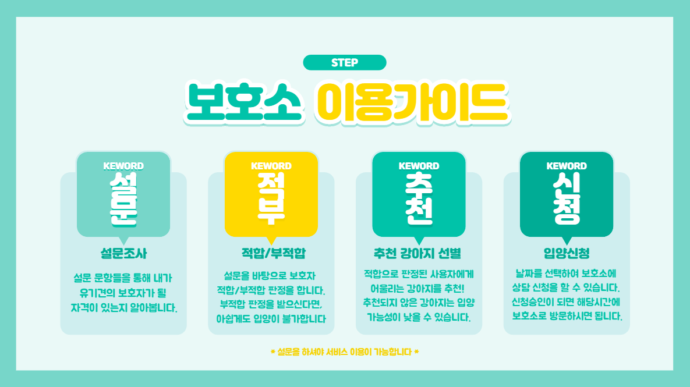

___

> 유기견 보호소와 입양 희망자가 보다 쉽게 입양 절차를 밟을 수 있도록 하여, 유기견이 가족을 찾을 수 있도록 도와주는 WEB Service입니다.

## :dog: 팀 소개

### 1) 팀명 < Dogker >

### 2) 팀원

| 
Name
 | 
Role
 | 
Code Name
 |
| --------------------- | --------------------- | -------------------------- |
| **길훈성** (팀장)     | Back-end              | :older_man: 얼신(어르신)   |
| **김민주**            | Back-end              | :princess: 빚월(비주얼)    |
| **김준기**            | Front-end             | :moneybag: 붤커(브로커)    |
| **김진실**            | Front-end             | :crown: 대장               |
| **최보근**            | Front-end             | :computer: 코더            |

## :dog: 프로젝트 소개

### 1) 프로젝트 명 < Be My Family >

### 2) 페이지 구성

- :closed_book: **메인 페이지**

  - 각 게시판의 최신 글을 미리 볼 수 있습니다.
  - 각 게시판으로 이동할 수 있습니다.

  

- :round_pushpin: **로그인**

  - 사용자와 매니저를 구분하여 로그인할 수 있습니다.
  - 계정이 없다면 회원가입을 통해 만들 수 있습니다.
  - 비밀번호를 잊으셨다면 비밀번호 찾기를 통해 임시 비밀번호를 발급 받으실 수 있습니다.

  

- :black_nib: **회원가입**

  - :woman:  **사용자**

    - 개인 정보를 입력한 후 완료버튼을 누르면 등록한 이메일로 인증 번호를 받을 수 있습니다.
    - 인증 번호를 입력하면 회원가입을 완료하실 수 있습니다.

  - :office: **매니저**

    - 저희가 만들어 준 가계정을 받아 회원 정보 수정 후 페이지를 계속 이용하실 수 있습니다.

    

- :raising_hand: **​마이페이지**

  - :woman: **사용자**

    - 회원 정보를 수정, 삭제할 수 있습니다.
    - 유기견 입양 신청 목록을 확인할 수 있습니다.

  - :office: **매니저**

    - 매니저 정보를 수정, 삭제할 수 있습니다.

    

- :+1:**​관심목록 (사용자)**

  - 보호소 게시판에서 선택한 강아지를 확인할 수 있습니다.
  - 강아지 위에 마우스를 올리면 간단한 강아지 정보를 확인할 수 있습니다.
  - 클릭 시 강아지 상세 정보로 이동합니다.

  

- :page_with_curl:**​설문조사(사용자)**

  - 설문을 통해 사용자가 입양이 적합한지 판별을 합니다.
  - 사용자에게 맞는 강아지를 추천하는 기능을 활성화합니다.

  

- :office: **Manager 페이지(매니저)**

  - 해당 보호소에 입양 신청한 사용자의 정보와 설문 정보를 확인할 수 있습니다.
  - 사용자가 입양 신청한 강아지 정보도 확인할 수 있습니다.
  - 입양 신청에 대해 완료 및 거절을 할 수 있습니다.

  

- **유기견 보호소 게시판**

  - :pushpin: 목록 

    - 전국의 유기견 보호소에 있는 강아지들을 확인할 수 있습니다.
    - 품종, 지역 별로 검색을 할 수 있습니다.
    - 강아지를 클릭하면 상세보기로 갈 수 있습니다.
    - 설문 조사 후 입양이 적합한 사용자에게는 추천 문구가 보입니다.

  - :pushpin: 상세

    - 해당 강아지에 대한 상세 정보를 확인할 수 있습니다.
    - 로그인 되어 있다면 관심 강아지로 등록할 수 있습니다.
    - 설문 조사 후 **입양 신청** 버튼이 활성화 됩니다.

  - :pushpin: 입양 신청

    - 사용자의 정보 및 설문 조사 내용과 함께 상담 날짜, 시간을 정합니다.
    - 사용자는 마이페이지의 입양 신청 목록에서 확인할 수 있습니다.
    - 매니저는 Manger 탭에서 사용자의 입양 신청 정보를 확인할 수 있습니다.

    

- **실종/보호/목격 게시판**

  - :pushpin: 목록

    - 사용자로 로그인 되어 있다면 게시물을 작성할 수 있습니다.
    - 실종, 보호, 목격 카테고리 별로 게시물들을 확인할 수 있습니다.
    - **키워드 검색 기능**을 통해 검색할 수 있습니다.
    - 게시물을 클릭하면 상세 페이지로 이동할 수 있습니다.

  - :pushpin: 키워드 검색 기능

    - `#` 뒤에 키워드를 입력하고 enter를 누르시면 키워드가 만들어 집니다.

  - :pushpin: 상세

    - 게시물의 상세 정보를 확인할 수 있습니다.
    - 사용자로 로그인 되어 있다면 해당 게시물에 댓글을 작성할 수 있습니다.
    - 실종 카테고리의 게시물은 보호/목격 카테고리의 게시물의 지역, 품종 정보를 통해 매칭이 됩니다.
    - 보호/목격 카테고리의 게시물 또한 실종 카테고리와 매칭되어 확인할 수 있습니다.

    

- **입양 후기 게시판**

  - :pushpin: 목록
    - 사용자로 로그인 되어 있다면 입양 후기 게시물을 작성할 수 있습니다.
    - 목록을 클릭하면 상세 페이지로 이동할 수 있습니다.
  - :pushpin: 상세
    - 입양 후기 상세 정보를 확인할 수 있습니다.
    - 사용자로 로그인 되어 있다면 게시글 별로 댓글을 작성할 수 있습니다.

## :dog: 개발 환경

### Front-end

- Vue
- Vuex
- Vuetify
- Node.js(npm)

### Back-end

- SpringBoot
- Maven
- JPA
- MariaDB
- Docker

### 배포

- AWS

# :heartpulse: 감사합니다​ :heartpulse: